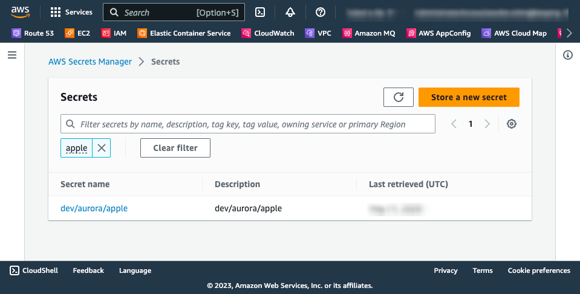
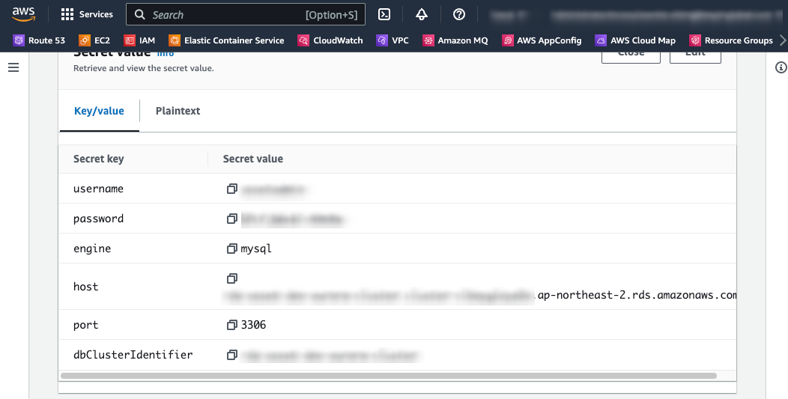

# spring-boot-starter-aws-secrets-manager-demo

`spring-boot-starter-aws-secrets-manager` 오픈 소스를 활용 하여 [AWS Secrets Manager](https://aws.amazon.com/ko/secrets-manager/) 에서 관리 되는 민감한 정보를 쉽게 액세스 하는 Demo 프로젝트 입니다.  


<br>

## Business Challenge

[Secrets Manager](https://aws.amazon.com/ko/secrets-manager/) 는 고객이 중요한 암호, API 키, 기타 비밀 정보를 안전하게 저장하고 액세스 제어 및 로테이션을 관리할 수 있는 관리형 서비스입니다.  

여기서는 `spring-boot-starter-aws-secrets-manager` 를 통해 간단한 설정 만으로 애플리케이션이 사용하는 민감한 정보에 대해 보안을 강화하고, 
애플리케이션 코드에서 분리하여 유지보수성과 보안성을 높일 수 있도록 확인 합니다. 

<br>

## Pre-Requisite

- AWS 관리 콘솔의 `AWS Secrets Manager` 서비스를 통해 RDS 접속 정보와 같은 민감한 정보(예: "dev/aurora/apple") 를 Secrets 로 사전에 등록 합니다.  



<br>

- 등록된 Secrets(예:"dev/aurora/apple")는 아래와 같이 데이터 셋으로 구성 및 관리 할 수 있습니다.  



<br>

- `dev/aurora/apple` Secrets 아이디로 등록된 정보를 Map 객체로 한번에 액세스 할 수 있습니다.

```
    @SecretsValue("dev/aurora/apple")
    private Map<String, String> rdsInfo;
```

<br>

- `dev/aurora/apple` 아이디로 등록된 Secrets 정보 중 특정 속성(예: "dbClusterIdentifier")을 지정하여 액세스 할 수 있습니다.

```
    @SecretsValue(value = "dev/aurora/apple", name = "dbClusterIdentifier")
    private String dbClusterIdentifier;
```

<br>

- `application.yaml` 의 spring properties 설정 파일 내에서 직접 참조 역시 가능 합니다.  

```
spring:
  config:
    import: "secretsmanager:dev/aurora/apple"
  cloud:
    aws:
      secrets-manager:
        region: ap-northeast-2
        provider-type: default
  datasource:
    username: ${dev/aurora/apple.username}
    password: ${dev/aurora/apple.password}

```


<br>

## Git

```
git clone https://github.com/simplydemo/spring-boot-starter-aws-secrets-manager-demo.git

cd spring-boot-starter-aws-secrets-manager-demo
```


<br>

## Build

```
mvn clean package -DskipTests=true
```

<br>

## Run

```
export AWS_PROFILE=your-aws-profile
java -jar -Dspring.profiles.active=local target/spring-boot-starter-aws-secrets-manager-demo-1.0.0.jar
```

<br> 


## Refereneces
- [AWS SDK for Java 2.x](https://docs.aws.amazon.com/sdk-for-java/latest/developer-guide/home.html)
- [spring-boot-starter-aws-secrets-manager](https://github.com/thenovaworks/spring-boot-starter-aws-secrets-manager)
- [spring initializr](https://start.spring.io/)


## Conclusion

[Secrets Manager](https://aws.amazon.com/ko/secrets-manager/) 를 통해 개발자 및 보안 관리자는 비밀 정보의 보호와 관리에 필요한 시간과 노력을 줄일 수 있으며, 비즈니스 전반적인 보안 수준을 향상시킬 수 있습니다.    
또한, AWS 서비스 및 외부 서비스에 대한 암호와 API 키와 같은 자격 증명을 보호할 수 있어 보안 및 규정 준수 정책을 높은 수준으로 유지 할 수 있습니다.     
  
`spring-boot-starter-aws-secrets-manager` 오픈 소스를 통해 Secrets Manager 를 간판하게 적용 함으로써 개발자 및 보안 관리자는 
비밀 정보의 보호와 관리에 필요한 시간과 노력을 줄일 수 있으며, 비즈니스 전반적인 보안 및 규정 준수 정책을 높은 수준으로 유지 할 수 있습니다.  

부가적으로 AWS 에서 제공하는 [AWS SDK for Java 2.x](https://docs.aws.amazon.com/sdk-for-java/latest/developer-guide/home.html) 버전을 을 기준으로 구현 되고, secrets manager 를 액세스 하기 위한 꼭 필요한 라이브러리만 참조 하고 있습니다.      
이를 통해 AWS Serverless Fargate 및 Lambda 와 같은 경량화된 워크로드에 적용이 용이 하고 Containerize 를 보다 쉽게 구성할 수 있습니다.  
